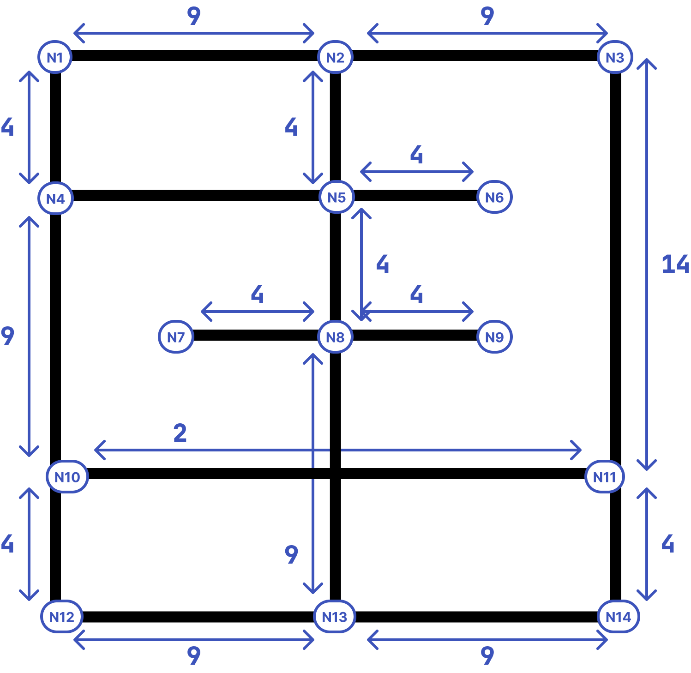

# Shortest Path Computation

Please compute the shortest path using Dijkstra’s Algorithm with the cost values from the map below:

- Edge costs = number of RFID tags in between nodes
- Special exception: the bridge between node 10 and node 11 is a shortcut and has a fixed cost of 2 (even if it normally has more tags) 

